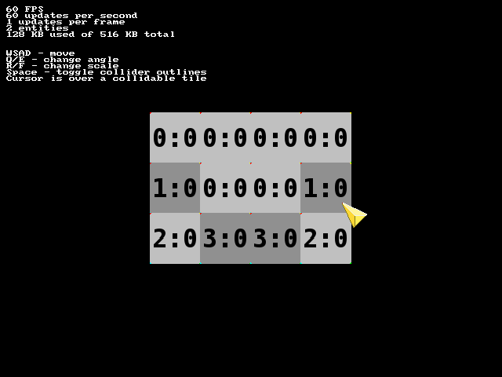

Nimgame 2: Demo 13
==================

TileMap demo. Demonstrates tile maps usage.

Note
----
For the performance purposes TileCollider is based on BoxCollider. It means, that usually you shouldn't initialize collider on a TileMap that will be rotated.

