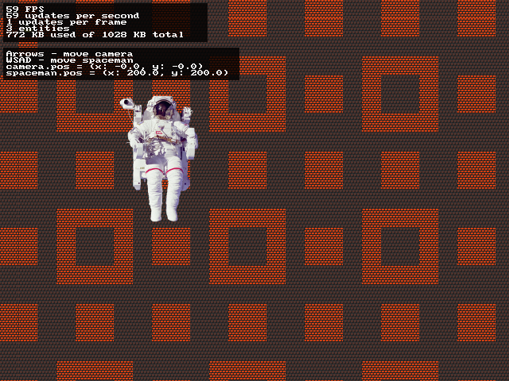

Nimgame 2: Demo 15
==================

Camera demo. Demonstrates camera usage.

Camera here is just a root entity and a parent of map entity.
If you want an object to be affected by scrolling,
assign the camera or map entity as its parent.

Note a negative sign in front of the camera's position.

